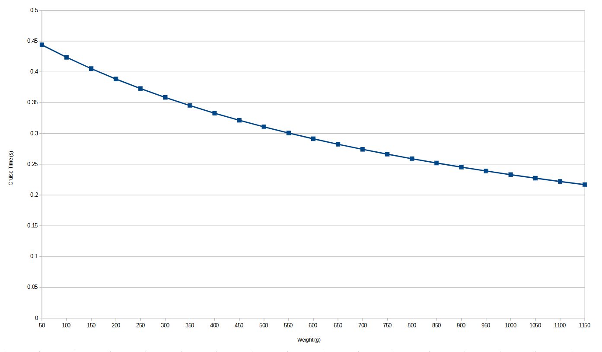

# Espooler Print Assist

AFC has the ability to activate espooler forward movement when printing to help prevent spools from walking around and
riding up wheels when they get low. This feature is enabled by default once your filament weight gets below 500 grams.  

The goal of this is to enable the spooler for a small amount of time so that filament on the spool is loosened up some,
then by the time your printer extrudes `delta_movement` amount(defaults to 150) the filament on your spool should just
be getting taut before print assist activates again.  

This feature can be turned off by adding `enable_assist: False` to your `[AFC_BoxTurtle Turtle_(n)]` or `[AFC]` or per
`[AFC_stepper]` config sections. If you would like to change the weight value where print assist is activated, then add
`enable_assist_weight: <new_number>` to your configuration, this value can be added to the same sections as
`enable_assist` variable.

The following variables described in [AFC_lane](../configuration/AFC_UnitType_1.cfg.md#afc_lane-lane_name-section) section
are all the values that go into the print assist logic: `enable_assist`, `enable_assist_weight`, `timer_delay`,
`delta_movement`, `spoolrate`, `spool_ratio`, `full_weight`, `spool_outer_diameter`, `spool_inner_diameter`,
`espool_rot_dist`, `max_motor_rpm`. These values can be configured per lane (`AFC_stepper`) or per Unit
(`AFC_BoxTurtle`).

With this functionality the following macros allow you to enable/disable and tweak the settings for print assist:

- [SET_ESPOOLER_VALUES](../klipper/internal/lane.md#AFC_assist.Espooler.cmd_SET_ESPOOLER_VALUES)  
- [ENABLE_ESPOOLER_ASSIST](../klipper/internal/lane.md#AFC_assist.Espooler.cmd_ENABLE_ESPOOLER_ASSIST)  
- [DISABLE_ESPOOLER_ASSIST](../klipper/internal/lane.md#AFC_assist.Espooler.cmd_DISABLE_ESPOOLER_ASSIST)  
- [TEST_ESPOOLER_ASSIST](../klipper/internal/lane.md#AFC_assist.Espooler.cmd_TEST_ESPOOLER_ASSIST)    

If the default values for print assist are unspooling too much you can start off by changing either `max_motor_rpm` or
`spool_ratio` to decrease the time that the N20 motors are active (aka cruise_time).

Below is the default cruise time dependent on weight when using default variables:


Formula to calculate `cruise_time`:
```python
rps = max_motor_rpm / 60
spool_rot_s = (espool_rot_dist * (rps / spool_ratio)) / (spool_outer_diameter * PI)
w_r = ((weight / full_weight) + 1) * ((spool_outer_diameter - spool_inner_diameter) * PI)
cruise_time = delta_movement / w_r / spool_rot_s
```
