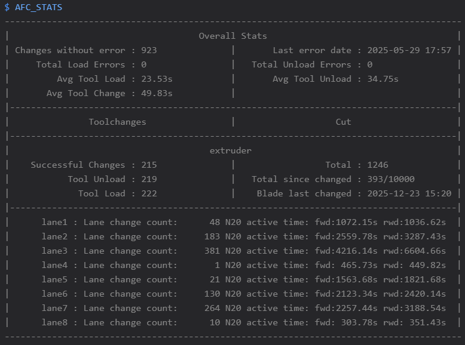
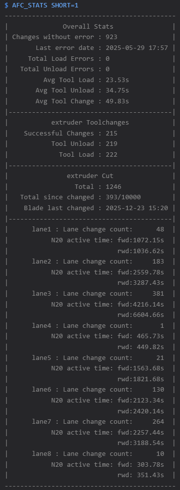

# Tracking Toolchange Statistics

AFC tracks all toolchanges, lane loading/unloading, number of changes since last load error, number of errors that
happened while unloading or loading, total number of cuts performed, number of cuts since blade last changed and how
long N20 motors have been active if N20 are configured in your setup.  

AFC will also start warning in console when your number of blade cuts is 1k less than the tool cut threshold letting you
know that it's getting close to change blade. Once number of cuts exceed threshold AFC starts printing out error
messages in the console. If blade is changed use `AFC_CHANGE_BLADE` macro to reset count and date blade was changed.  

Use the following macros to print out statistics in console, update when blade has been changed and reset N20 active
time:  
- [AFC_STATS](../klipper/internal/misc.md#AFC.afc.cmd_AFC_STATS) - prints statistics to console  
- [AFC_CHANGE_BLADE](../klipper/internal/misc.md#AFC.afc.cmd_AFC_CHANGE_BLADE) - run macro when blade is changed, sets date
  that blade was changed and resets `Total since changed` count  
- [AFC_RESET_MOTOR_TIME](../klipper/internal/lane.md#AFC_assist.Espooler.cmd_AFC_RESET_MOTOR_TIME) - run macro when N20
  motor has been swapped out in a lane  
- [AFC_RESET_STATS](../klipper/internal/misc.md#AFC.afc.cmd_AFC_RESET_STATS) - run macro to reset extruder and lane counts

Both variables can be added/updated in `[AFC]` [section](../configuration/AFC.cfg.md#afc-section) :  
- `print_short_stats`: Add/uncomment to have the statistics printout to be skinnier. Useful for those that have consoles
  that are skinnier (eg. Klipperscreen )  
- `tool_cut_threshold`: Defaults to 10000 cuts, update to if you want threshold to be larger. This controls when AFC
  prints out warning/errors when number of cuts since changed reaches/exceeds this number.

!!!note
    As of AFC-Klipper-Add-On version 1.0.34 new averaging for load times was introduced. Before AFC would not keep track
    of the total time when averaging, now AFC has the ability to keep track of total time and average with load counts.
    For AFC to calculate the new averages, the [AFC_RESET_STATS](../klipper/internal/misc.md#AFC.afc.cmd_AFC_RESET_STATS)
    macro needs to be run like the following(this will reset your current extruder counts and load times):  
    `AFC_RESET_STATS EXTRUDER=all`.

    Once this macro is run, Moonraker's database will first be backed up just in case someone would like to restore
    previous stats before resetting values. This reset needs to happen for AFC to average load times correctly based on
    load counts.

Examples of what statistics printout looks like:  

