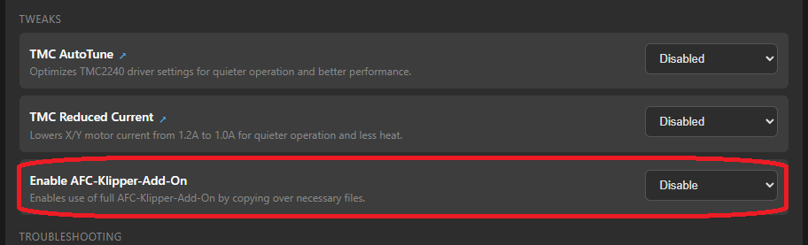
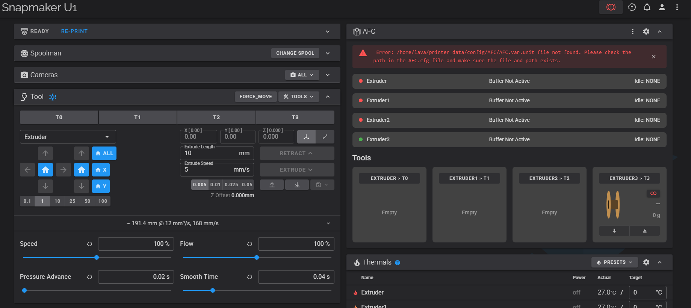

## Install the AFC Klipper Add-On

=== "Supported Automated Filament Changers"

    Your AFC unit works with the [AFC Klipper Add-On](https://github.com/AFCProject/AFC-Klipper-Add-On). The rest of
    this guide will focus on configuring AFC for use with your unit.

    Follow the instructions on that GitHub for the latest details on installation and configuration, but at the time of writing
    this is the easy button:

    ```sh
    cd ~
    git clone https://github.com/AFCProject/AFC-Klipper-Add-On.git
    cd AFC-Klipper-Add-On
    ./install-afc.sh
    ```

    After running `./install-afc.sh` you should now see an AFC splash screen with multiple options

    1. Hit `I` then enter to start installing a new system.  
        __Note__: If you don't see `I` as an option and you see `Prior AFC-Klipper-Add-On installation detected: True` then choose `A` to add additional units. Then follow the instructions on the [Additional Units page](../additional-units/index.md) once done with steps on this page.
    1. Installer defaults to a BoxTurtle unit, if you have something else, hit `T` then enter to cycle through the different supported units.
    1. If you would like to enable/disable options 1-8, choose that option then hit enter to cycle through the options.
    1. Installer defaults to using a buffer as a toolhead sensor, if you would like to use a toolhead sensor, hit `9` then enter to cycle until you see sensor. 
        1. If you know you toolhead sensor pin now, hit `A` then enter and input your pin. If you need to add a pullup(`^`) add this to your pin definition now. ex: `^nh36_0:gpio3`
    1. If there are unit specific options for your unit, please make sure these are selected correctly for your setup. ex. If you have a 2 lane EMU with a SLB board, make sure EMU Lane option is set to 2 and EMU board option is set to SLB.
    1. Once everything is selected correctly, hit `I` then enter to install AFC and have the proper config files moved into your `printer_data/config/AFC` folder.
    The default options for the park, cut, kick, wipe, and tip forming macros can be used if you don't know what to choose.
    These can all be changed later by editing `AFC/AFC.cfg` and doing a firmware restart.

    After the installation completes, you should now see an AFC folder in your printer configuration directory, along with
    several files in there named `AFC.cfg`, `AFC_Hardware.cfg`, `AFC_Macro_Vars.cfg`, and a unit-specific configuration
    file (e.g., `AFC_Turtle_1.cfg` for BoxTurtle). The exact filename depends on the unit type you chose during
    installation. If you do not see these files, or if you see duplicate files (e.g., your `printer.cfg`) -
    this may be a caching issue with your web UI (Mainsail/Fluidd). Force a refresh with shift-reload or Ctrl+F5 and the
    problem should resolve itself.

    ### Post-Installation Configuration
    After installation, please ensure you update the following settings:


    - In your unit-specific config file (e.g., `AFC/AFC_Turtle_1.cfg` for BoxTurtle):
        - `canbus_uuid` if using CAN bus
        - `serial` if using USB
    - In `AFC/AFC_Hardware.cfg`
        - `pin_tool_start` and/or `pin_tool_end`

    In your `printer.cfg`'s `[extruder]` section, update the setting `max_extrude_only_distance` to the value 400. If
    the setting is not there, add it:

    `max_extrude_only_distance: 400`

    Depending on your configuration, you may also need to add the following line to your `printer.cfg`'s `[extruder]` section:

    `max_extrude_cross_section: 50`

    However, this should only be added if a warning appears in the logs about the extruder cross-section being too small.
    If you do not see this warning, you can skip this step.

    Review all x,y,z positions in the `AFC/AFC_Macro_Vars.cfg` file to ensure they are correct for your printer for any macros
    you have enabled.
    
    ### Unit specific checks
    === "EMU"
        !!! note
            Throughout this guide you will see text like `EMU_(x)_lane(x)`, you will not see this in your config file. Instead you will see something like `EMU_1_lane1`, the x's are a place holder to signify a generic unit/lane number for your setup.
        
        #### Verify MCU config file
        In AFC/mcu/EMU_(x).cfg file verify that mcu entries looks correct and has all your MCU lanes listed

        #### Verify Temperature Sensor
        Config file defaults to using BME280 temperature, if you are using the AHT20 sensor then the following needs to be updated in your AFC/AFC_EMU_(x).cfg file. There are also comments in this file to help you update to use the correct settings

        1. In `[temperature_sensor lane(x)]` config sections comment out:
            ```ini
            sensor_type: BME280
            i2c_address: 118
            ```
            and uncomment:
            ```
            sensor_type: AHT2X
            i2c_address: 56
            ```
        1. If using SLB board and would like to use hardware I2C, comment out:
            ```
            i2c_software_scl_pin: EMU_(x)_lane(x):TEMP_SCL
            i2c_software_sda_pin: EMU_(x)_lane(x):TEMP_SCA
            ```
            and uncomment:
            ```
            i2c_bus: i2c2_PB10_PB11
            ```
        1. Repeat for all lanes

        #### Verifying Led Indicator Settings
        Config file defaults to using ebb36/42 settings, if using SLB board make the following changes for all your lanes.

        === "EBB36/42"
            1. Uncomment the following AFC_led config section:
                ```
                [AFC_led EMU_(x)_Indicator_(x)]
                pin: EMU_(x)_lane(x):RGB
                chain_count: 5
                color_order: GRBW
                initial_RED: 0.0
                initial_GREEN: 0.0
                initial_BLUE: 0.0
                initial_WHITE: 0.0
                ```
            1. Repeat for all lanes
        === "SLB"

            1. In `[AFC_stepper lane(x)]` config section comment out:
                ```
                led_index: EMU_(x)_Indicator_(x):1
                led_spool_index: EMU_(x)_Indicator_(x):2
                ```
                and uncomment:
                ```
                led_index: EMU_(x)_Indicator_Button_(x):1-4
                led_spool_index: EMU_(x)_Indicator_Box_(x):1
                ```

            1. Uncomment the following AFC_led config sections
                ```
                [AFC_led EMU_(x)_Indicator_Button_1]
                pin: EMU_(x)_lane(x):RGB_button
                chain_count: 4
                color_order: GRBW
                initial_RED: 0.0
                initial_GREEN: 0.0
                initial_BLUE: 0.0
                initial_WHITE: 0.0

                [AFC_led EMU_(x)_Indicator_Box_1]
                pin: EMU_(x)_lane(x):RGB_box
                chain_count: 1
                color_order: GRBW
                initial_RED: 0.0
                initial_GREEN: 0.0
                initial_BLUE: 0.0
                initial_WHITE: 0.0
                ```
            1. Repeat for all lanes

        #### Using non sensorless hubs
        By default AFC EMU configs are setup to run with ["sensorless" hubs](../configuration/AFC_UnitType_1.cfg.md#notes-about-default-emu-config-setup), if you would like to use a hub sensor then make the following changes to your `[AFC_hub EMU_(x)_HUB]` section:

        1. For `switch_pin` variable, replace `virtual` with the actual sensor pin you are using for you hub
        1. In each `[AFC_stepper lane(x)]` sections update `dist_hub` to be closer to what your actual length is between your lanes load sensor and hub sensor.
        1. Remove `use_dist_hub: True` line
        1. Update `hub_clear_move_dis: 5` value to be closer to the value that AFC needs to move the filament so its not blocking the hub. Or this value can be removed and AFC will use the default value of 65


    For best results, reboot your printer after installing the Add-On and including it in your printer.cfg. This will ensure
    all required modules are enabled.

=== "Snapmaker U1"
    <a id="snapmaker-u1"></a>
    --8<-- "includes/u1/warning.md"

    Currently not implemented into Snapmaker U1 Extended Firmware by paxx12, currently binaries can be found in AFCProject discord.

    If you have __Snapmaker U1 Extended Firmware__ already installed, you can follow steps 1-4 on the [update](../updates/updates.md#snapmaker-u1-printer) page and then come back to this page and finish steps 4-7

    1. Before installing, please make sure to fully unload all filament thats currently loaded into your toolheads.
    <!--  Removing below until the changes actually make it into the extended firmware repo 1. Navigate to Snapmaker U1 Extended Firmware [release page](https://github.com/paxx12-snapmaker-u1/SnapmakerU1-Extended-Firmware/releases) and download latest binary. -->
    1. Once binary is downloaded follow [Snapmaker U1 Extended Firmware installation instructions](https://snapmakeru1-extended-firmware.pages.dev/install)
    1. Once installation is done, to enable AFC-Klipper-Add-On open your web browser and navigate to `http://<ip-address>/firmware-config`. Be sure to replace `<ip-address>` with your Snapmaker U1 IP address.
    1. Navigate down to Snapmaker Components section and in the drop down for Enable AFC-Klipper-Add-On Plugin, choose `Enable`, then select `Confirm`.  
        __Note: Do not enable `AFC Lite via Fluidd/Mainsail` version, this is not the full version of AFC.__
    
    1. Once that is done and the box shows `SUCCESS: Setting updated successfully`, navigate back to your printers fluidd interface. If enable was done correctly, the T0-T31 tools should now only show T0-T3 and your AFC panel should look something like below and there should not be any Klipper errors.
    
    1. The error that shows up is normal and can be ignored and closed out with the `x` on the right. If it keeps showing up please consult for help in the AFCProject discord.

    <!--
    Commenting this out for now since we have found that the PTFE inside can move
    --8<-- "includes/snapmaker-u1-ptfe.md"
    -->

    [Next Step](09-slicer-config.md#snapmaker-u1)