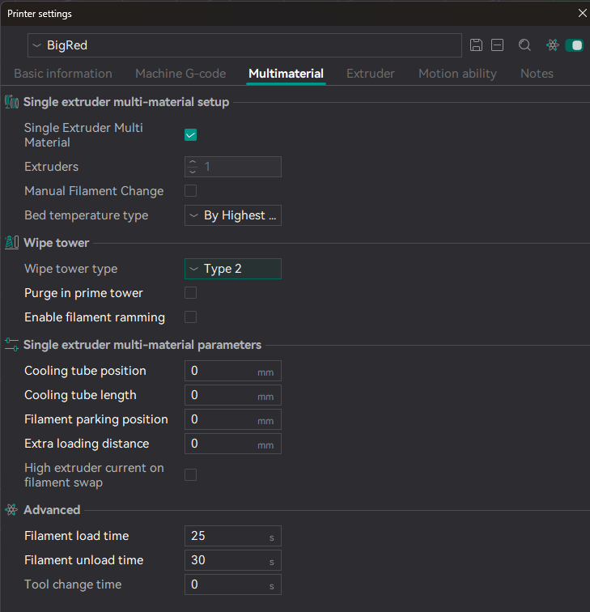
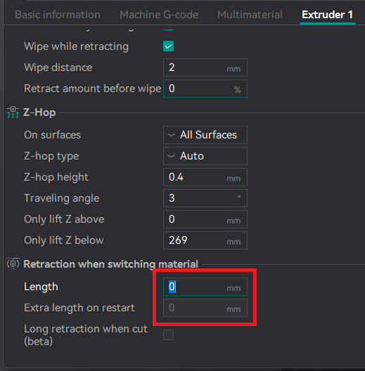
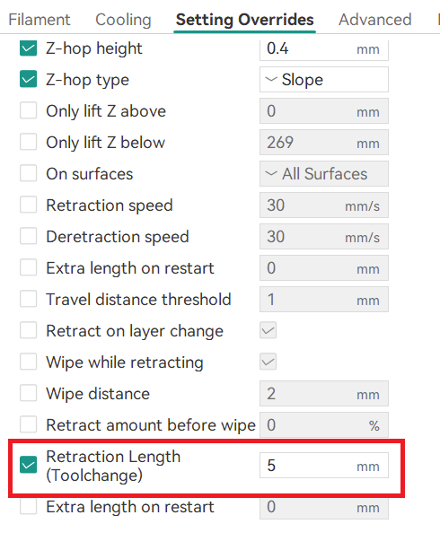

=== "All Printers"

    ### Configuring your slicer

    The recommended slicer for AFC is OrcaSlicer. Other slicers such as PrusaSlicer or SuperSlicer may be used, and the
    configuration of options within them is similar but naming or options may be slightly different.

    #### Updating printer settings in Orca

    !!! note
        Wording for setting may differ between slicer versions

    For the printer you are adding your AFC unit to, first go to the Printer settings, Multimaterial tab and ensure settings are
    configured as per the below screenshot.
    

    !!! note

        Only select the `Purge in prime tower` option when you are not using the `POOP` macro/functionality.

    !!! note

        Ensure you select `Type 2` as the wipe tower type. 

    Also, on the Extruder 1 setting page - reduce `Retraction while switching material` length from the default of 2 to 0.

    

    #### Adding additional filaments/extruders

    Increase the number of filaments to match your unit's lane count.  
    

    #### Updating the Machine G-code settings

    - Set `Machine start G-code` appropriately for your printer, specifically adding the `TOOL={initial_tool}` to your `
    PRINT_START` macro.

    !!! note

        More information about the `PRINT_START` macro will be covered in the next section, so keep this in mind!

    ``` g-code
    M104 S0 ; Stops OrcaSlicer from sending temperature waits separately
    M140 S0 ; Stops OrcaSlicer from sending temperature waits separately
    PRINT_START EXTRUDER=[nozzle_temperature_initial_layer] BED=[bed_temperature_initial_layer_single] TOOL={initial_tool}
    ```

    - Set `Change Filament G-Code` to the below value. Remove any other custom code here, e.g. extruder moves.

    ``` g-code
    T[next_extruder] PURGE_LENGTH=[flush_length]
    ; FLUSH_START
    ; EXTERNAL_PURGE {flush_length}
    ; FLUSH_END
    ```

    ### Changes when using PrusaSlicer

    For the most part, many of the above settings are also applicable to other Slic3r derivatives such as PrusaSlicer or
    SuperSlicer. Below are a list of some of the deviations. Reth also created a very good summary of the overview of tuning
    changes for PrusaSlicer in [this video](https://www.youtube.com/watch?v=ilxtHVNhsM4).

    - Instead of 'Change Filament G-Code', update the 'Tool Change G-Code' in printer settings to the below.

    ``` g-code
    T[next_extruder]
    ```

    - Under each extruder in printer settings, change the default value of 'Retraction when tool is disabled' from 10mm to
    0.5mm.

    #### Additional Slicer configuration - pre-OrcaSlicer 2.2.0

    Configuring per-material filament ramming is no longer required as of the official OrcaSlicer 2.2.0 release (
    PR [#6934](https://github.com/SoftFever/OrcaSlicer/pull/6934)). If you are on an earlier version than that (including
    betas/release candidates) you will need to make the following additional changes to your slicer configurations.

    ### Cura Slicer Setup (User reported settings)

    ``` g-code
    ;Filament name = {material_brand} {material_name}
    ;Filament type = {material_type}
    ;Filament weight = {filament_weight}
    ;Nozzle diameter = {machine_nozzle_size}
    PRINT_START STANDBY={material_standby_temperature} BED={material_bed_temperature_layer_0} EXTRUDER={material_print_temperature_layer_0} TOOL={initial_extruder_nr}
    ```

    #### Material Settings

    

    ##### Ramming Settings

    Because the AFC-Klipper-Add-On handles any tip forming in the extension, we need to disable these specific settings in
    the slicer software. Below is a screenshot for OrcaSlicer, but most Slic3r-based slicers have a similar dialog/setting.
    


    ### Other slicers

    PrusaSlicer - https://www.youtube.com/watch?v=ilxtHVNhsM4

=== "Snapmaker U1"
    <a id="snapmaker-u1"></a>
    ### Configuring Print Start Macro in Orca Slicer
    
    !!! note
        As of this posting, the following Print Start macro change is needed so that AFC can properly work on your U1. As new features are added to AFC to support U1 additional features, this print start macro section will be updated. The print start macro can also be found in the AFCProject [github](https://github.com/AFCProject/AFC-Klipper-Add-On/blob/main/templates/u1_macros/u1_print_start.txt)

    In Orca Slicer open your printer settings, in the Machine G-code tab remove the current code in the __Machine start G-code__ section and copy/paste the code below. Don't forget to save your updates.

    This is the last step in setting up AFC on your U1 printer, now have fun printing with AFC and if any issues arise please don't hesitate to ask questions in the AFCProject discord.

    If you would like to add an Automated Filament Changer to your U1 please follow the normal [install](../initial-startup/03-install-plugin.md#supported-automated-filament-changers) instructions for the unit you are trying to add to your printer.

    ```
    SET_PRINT_AUTO_BED_LEVELING ENABLE=1
    SET_TIME_LAPSE_CAMERA ENABLE=1
    ;===== date: 20251222 =====================

    PRINT_START
    ; DEFECT_DETECTION_START
    SET_PRINT_STATS_INFO TOTAL_LAYER={total_layer_count}
    SET_PRINT_STATS_INFO CURRENT_LAYER=0
    TIMELAPSE_START
    M140 S{bed_temperature_initial_layer_single}
    M104 T{initial_extruder} S140
    M204 S10000

    G28

    ;===== 床面异物检测 ========
    ;T{initial_extruder}
    G90
    ;DEFECT_DETECTION_DETECT_BED
    ;===== 取放头检测 =================
    SM_PRINT_CHECK_SWITCH_EXTRUDER

    ;===== 自动进料 & 挤出流量 & 预挤出 ======================
    ;SM_PRINT_EXTRUDER_PREHEAT EXTRUDER=1 TEMP=140
    ;SM_PRINT_AUTO_FEED EXTRUDER=0
    ;SM_PRINT_FLOW_CALIBRATE EXTRUDER=0
    ;SM_PRINT_EXTRUDER_PREHEAT EXTRUDER=2 TEMP=140
    ;SM_PRINT_AUTO_FEED EXTRUDER=1
    ;SM_PRINT_FLOW_CALIBRATE EXTRUDER=1
    ;SM_PRINT_EXTRUDER_PREHEAT EXTRUDER=3 TEMP=140
    ;SM_PRINT_AUTO_FEED EXTRUDER=2
    ;SM_PRINT_FLOW_CALIBRATE EXTRUDER=2
    ;SM_PRINT_AUTO_FEED EXTRUDER=3
    ;SM_PRINT_FLOW_CALIBRATE EXTRUDER=3
    ;M104 S0 T0 A0
    ;M104 S0 T1 A0
    ;M104 S0 T2 A0
    ;M104 S0 T3 A0
    ;M104 T{initial_extruder} S{nozzle_temperature[initial_extruder] - 90}

    ;===== 粗回零 =================
    T{initial_extruder}
    M106 S255
    M106 P2 S0
    MOVE_TO_DISCARD_FILAMENT_POSITION
    M109 T{initial_extruder} S{nozzle_temperature[initial_extruder] - 90}
    ROUGHLY_CLEAN_NOZZLE_WITH_DISCARD
    MOVE_TO_XY_IDLE_POSITION_EXTRUDER
    G28 Z I140 J140

    ;===== 检测钢板 =================
    DETECT_BED_PLATE

    ;===== 深度清洁喷嘴 =================
    G90
    G0 Z5 F10000
    MOVE_TO_DISCARD_FILAMENT_POSITION
    M109 S{nozzle_temperature[initial_extruder] - 50}
    ROUGHLY_CLEAN_NOZZLE
    MOVE_TO_XY_IDLE_POSITION_EXTRUDER
    FINELY_CLEAN_NOZZLE_STAGE_1
    M104 S{nozzle_temperature[initial_extruder] - 90}
    G0 Z5 F10000
    MOVE_TO_DISCARD_FILAMENT_POSITION
    ROUGHLY_CLEAN_NOZZLE
    MOVE_TO_XY_IDLE_POSITION_EXTRUDER
    FINELY_CLEAN_NOZZLE_STAGE_2

    ;===== 精回零 =================
    M106 S255
    M109 S{nozzle_temperature[initial_extruder] - 90}
    M190 S{bed_temperature_initial_layer_single}
    M107 P2
    G90
    G0 Z5 F10000
    G28 Z

    ;===== 热床调平 =================
    ; Always pass `ADAPTIVE_MARGIN=0` because Orca has already handled `adaptive_bed_mesh_margin` internally
    ; Make sure to set ADAPTIVE to 0 otherwise Klipper will use it's own adaptive bed mesh logic
    BED_MESH_CALIBRATE mesh_min={adaptive_bed_mesh_min[0]},{adaptive_bed_mesh_min[1]} mesh_max={adaptive_bed_mesh_max[0]},{adaptive_bed_mesh_max[1]} ALGORITHM=[bed_mesh_algo] PROBE_COUNT={bed_mesh_probe_count[0]},{bed_mesh_probe_count[1]} ADAPTIVE=0 ADAPTIVE_MARGIN=0
    ; Original upstream: BED_MESH_CALIBRATE PROBE_COUNT=11,11

    ;===== 画起始线 =================
    T{initial_extruder}
    M109 S{nozzle_temperature_initial_layer[initial_extruder]}
    G90
    G1 Z1.5
    G0 X10 Y3 Z2 F18000

    G1 Z0.2
    M83
    G1 X110 E15 F360
    G1 Z1.5

    G90
    M106 S0
    ```

    ### Extruder Configuration
    --8<-- "includes/retract_when_switching_material.md"

    ### Snapmaker Orca
    If using Snapmaker Orca, for each filament setting make sure that __Retraction Length (Toolchange)__ box is not checked

    