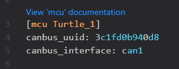
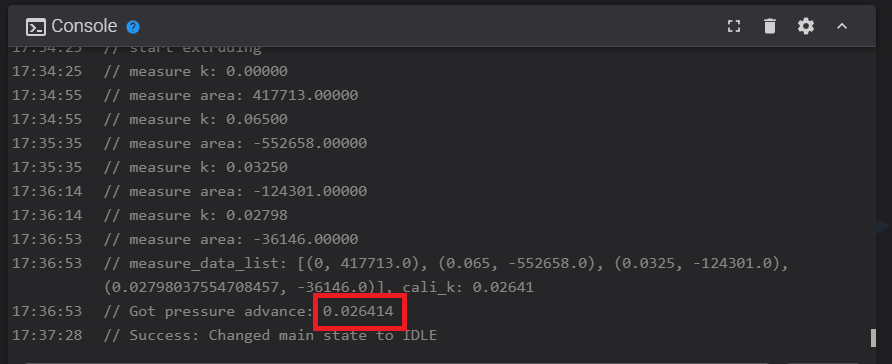
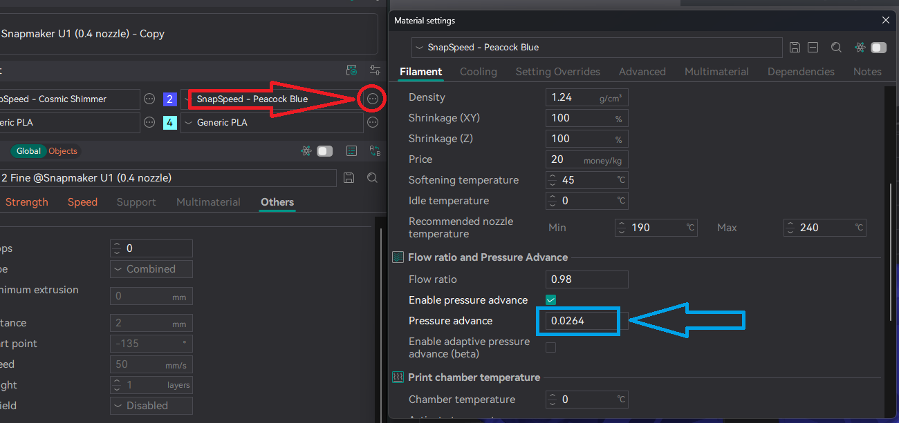

--8<-- "includes/u1/need_to_install_extended_fw.md"

Since Snapmaker has a custom and heavily modified version of Klipper, the following is what AFC works with on the U1. Given how AFC works and remaps all T(n) macros some of the stock U1 functionalities will not work with AFC installed. Below is a compiled list of what works with AFC install and what does not work(this is not an exhaustive list). Goal is to be able to add in support over time for the stock U1 functions that currently do work with AFC installed/enabled.

## Supports
- Using toolheads in standalone mode( no automated filament changer attached )
- Using automated filament changers attached to toolheads
- Assigning spoolman IDs when toolheads are loaded
- Remapping toolheads/lanes
- Infinite runout
- Automatically setting color/material type/vendor into Snapmaker print task config when loading filament to toolhead. This is the color/material/vendor that is normally set from the screen interface.
- Resume from pause and power loss
- More things can be found on [features](../features.md) page
- Stock spaghetti detection works with AFC installed
- Loading standalone lanes with side feeders work with AFC load commands or stock screen load interface

## Does Not Support
- Integration with RFID readers
- Automatic Flow Calibration, this can be done manually (see [Manual flow calibration with AFC installed](#manual-flow-calibration-with-afc-installed) section below)
- Automatic color mapping to toolhead/lane based off colors in print job
- XYZ calibration has not been tested yet, so you may need to disable AFC before re-running XYZ calibration offset
- Starting prints through Snapmaker Orca has not been tested and may not work correctly, start prints from fluidd/mainsail.
- Starting prints through screen may not always work, start prints from fluidd/mainsail.

And much more that has not been discovered yet.

## General Notes

<!--
Commenting this out for now since we have found that the PTFE inside can move
--8<-- "includes/snapmaker-u1-ptfe.md"
-->

- When using extruders in __standalone__ mode, choose one of the following ways to load filament to your toolhead after inserting filament into the feeders:
    - Once the feeders are done feeding you can manually move the filament to the toolhead gears. Once the toolhead filament sensor is triggered AFC will heat up the hotend and then finish loading to nozzle.
    - Load normally from the screen's loading section.
    - Use AFC to load by hitting the `Load Lane` button in the AFC panel.
    - Click on the correct T(n) macro.
    - Alternatively, if you start a print without preloading through AFC, AFC will load the filament automatically during the first print.

- Snapmaker U1 Extended Firmware by paxx12 does support CAN bus and its enabled by default, but you need to use a USB to CAN bus adapter or use a MCU in USB to CAN bridge mode. When setting up your MCU for CAN, be sure to specify `canbus_interface: can1` since CAN0 is the internal CAN bus chip that currently does not work. Should look something like the picture below:  

- When flashing your automatic filament changer MCU, make sure you use [u1-klipper](https://github.com/Snapmaker/u1-klipper) github repository.
- When using automatic filament changes on your U1, you need to enable [buffer ramming](../installation/buffer-ram-sensor.md#required-configuration) as AFC plugin does not use the current toolhead sensor when moving(homing) filament to the toolhead.

### Updating AFC
Update instructions can be found [here](../updates/updates.md#snapmaker-u1-printer) for updating AFC-Klipper-Add-On on your U1.

### Manual flow calibration with AFC installed
1. Load the filament that you would like to run flow calibration with and make sure toolhead is selected. If its not selected, run `AFC_SELECT_TOOL extruder=extruder(n)` where `n` is the toolhead to select(1-3), pass in `extruder` to select toolhead 0
1. After filament is loaded and toolhead is selected, run `FLOW_CALIBRATE TEMP=<target_temp>`.
1. Once done save the outputted flow calibration number, see the console below for which number to grab:

1. In your slicer(using Orca Slicer for this example) put this number into your printer filament profile in the pressure advance box. Click the edit for your printer profile as show by the red arrow, and then input the value in to the __Pressure Advance__ box as show by the blue arrow. If this box is grayed out, click the __Enable pressure advance__ box above.  
(Note: Orca rounds to 4 digits after profile is saved)

1. Save profile with save button in upper right.