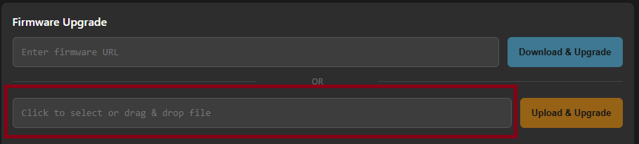
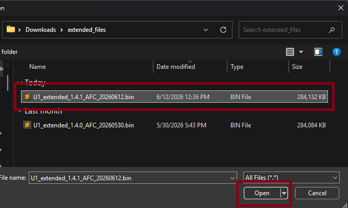
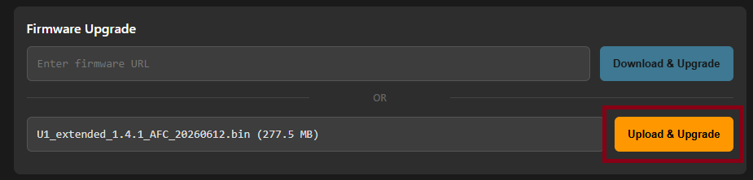

# Updating the AFC-Klipper-Add-On

=== "All Printers"
    Updating the AFC-Klipper-Add-On is a simple process that can be done through the `update-afc.sh` script.

    !!!warning

        Do **NOT** use the Moonraker update functionality to update the `AFC-Klipper-Add-On` software. It will
        not run the necessary update scripts and may cause issues with your installation.


    !!!note 

        If your AFC-Klipper-Add-On is < 1.0.35 (Any version prior to 24 Jan 2026), you should run a `git pull` in the 
        `~/AFC-Klipper-Add-On` directory before running the `update-afc.sh` script. This is NOT necessary if your 
        AFC-Klipper-Add-On is >= 1.0.35. 

    1. Connect to your printer via SSH and navigate to the AFC-Klipper-Add-On directory:  
    
    ```bash
    cd ~/AFC-Klipper-Add-On
    ```
    
    2. Run the `update-afc.sh` script:  

    ```bash
    ./update-afc.sh
    ```
    
    3. Select the `Update AFC Klipper Add-on` option from the menu that appears. This option will only
    appear if the system detects that the AFC-Klipper-Add-On is already installed.  

    4. Once in the `Update AFC Klipper Add-on` menu, select the `Update AFC-Klipper-Add-On` option. This will
    update the add-on to the latest version available in the repository.
    
        You will be prompted if you would like to update the AFC-provided macros during the update process.
        If you select `Yes`, the macros will be updated to the latest version available. If you select `No`, the macros will not be updated, and
        you will need to manually update them if you want to use the latest versions.

    5.  After the update is complete, Moonraker may still show an old version. Use the refresh button in the Mainsail/Fluidd
        interface to update the version information.

    !!!warning

        If you have made any changes to the AFC provided macros directory, those changes will be overwritten by the 
        update process. It is recommended to back up any custom macros before proceeding with the update.

=== "Snapmaker U1 Printer"
    <a id="snapmaker-u1-printer"></a>
    --8<-- "includes/u1/warning.md"
    
    AFC updates for Snapmaker U1 will be provided through new extended firmware binaries by the AFCProject team. Follow the step below to update once you have the new binary file:

    1. Navigate to `<ip-address>/firmware-config` page  
    1. Scroll to the bottom of the page and in the __Firmware Upgrade__ box, click in the `Click to select or drag & drop file` box.  
      
    1. Navigate to your new update binary, select file and then hit open(or whats equivalent to open on your system)  
    
    1. Once file is selected, _Upload & Upgrade__ becomes clickable, click Upload & Upgrade to start update process, then press Confirm to proceed with the update.
    
    1. Once update is done and printer is rebooted, please go back to firmware-config page (`<ip_address>/firmware-config`) and re-enable AFC.
    1. Navigate down to tweaks section and in the drop down for Enable AFC-Klipper-Add-On, choose `Enable`, then select `Confirm`
    
    1. Once that is done and the box shows `SUCCESS: Setting updated successfully`, navigate back to your printers fluidd interface. If enable was done correctly, the interface should look like the same before you updated.